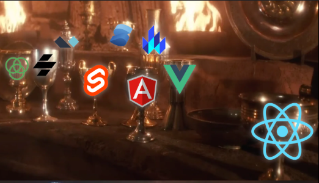

# Juniors dev will be junior forever! 🌀

Web development is evolving at an incredible pace, and the path to mastery has become increasingly crowded with shiny new frameworks and libraries. For junior developers, this often leads to a burning question: "What should I learn, and how should I learn it?"

With the popularity of React, the reactivity of Angular, the handiness of Svelte, the comfort of Remix, the magic of Tailwind CSS, and the blazing-fast UI development with shadcn, it’s easy to feel overwhelmed. The excitement around these tools is justified—they are amazing! But let’s pause for a moment and ask:

> Are we building our skills on a solid foundation or just stacking frameworks on shaky ground?

**_The Trap of the Framework Game_**

JavaScript is the heart of modern web development, and TypeScript takes it a step further by adding type safety and scalability. Yet, many developers dive into learning frameworks without mastering these foundational languages. This approach often leads to developers who can "make things work" but don’t understand why they work.

**_How to Level Up Your JavaScript Game_**

If you’ve been living in the "framework game" and want to break free, here’s a roadmap to improve your core JavaScript skills:

- _Understand the Basics_
  Learn about variables, data types, functions, and control structures.
  Get familiar with modern ES6+ features like destructuring, template literals, and arrow functions.

- _Master the Core Concepts_
  Closures, prototypes, this, and the event loop.
  Asynchronous programming: Promises, async/await, and callbacks.

- _Explore the DOM_
  Manipulate the DOM without libraries like jQuery.
  Understand event handling and propagation.

- _Deep Dive Into TypeScript_
  Embrace static typing to write more predictable and robust code.
  Learn about interfaces, generics, and type inference.

- _Build Without Frameworks_
  Create a simple project (like a to-do app) using only vanilla JavaScript and TypeScript. This will force you to think critically about structure and implementation.

- _Learn Design Patterns_
  Patterns like module, singleton, and observer can help you write scalable code.

Balancing Frameworks and Core Skills
It’s not wrong to use frameworks—they save time and simplify development. However, treat them as tools, not crutches. When you understand JavaScript and TypeScript deeply, you can use any framework more effectively.

> Remember, frameworks are replaceable. A strong understanding of JavaScript is timeless.
